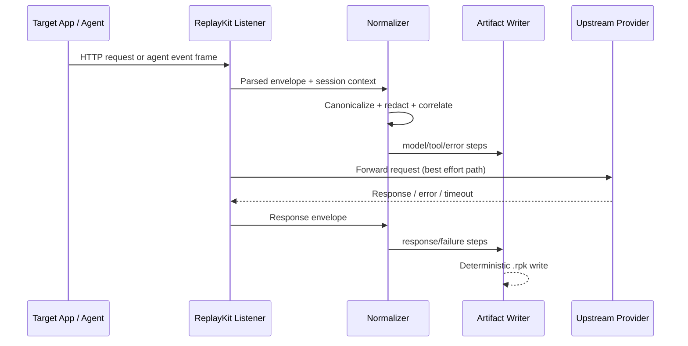

# Passive Listener / Interceptor Architecture (GAP-01)

## Goal

ReplayKit passive mode captures model and coding-agent traffic while target apps run independently.
ReplayKit is not the caller; it is a local listener and normalizer.

## Scope

In scope:

- Passive listener lifecycle (`listen start|stop|status|env`).
- Provider gateway normalization for OpenAI, Anthropic, and Gemini traffic.
- Passive coding-agent adapters for Codex and Claude Code event streams.
- Deterministic artifact output for replay/diff workflows.
- Secret-safe persistence guarantees on listener paths.

Out of scope:

- Cloud relay/SaaS ingestion.
- Hosted control plane.
- Provider-side instrumentation not visible to the local process boundary.

## High-Level Data Flow

## Module Boundaries

### `listener`

Responsibility:

- Run local daemon for passive capture.
- Manage listener session lifecycle and PID/port state.
- Receive provider/agent envelopes and route them to normalizers.

Interface:

- `start_listener(config) -> ListenerSession`
- `stop_listener(session_id) -> None`
- `listener_status() -> ListenerStatus`
- `listener_env(session) -> dict[str, str]`

Extension points:

- Transport backends (HTTP, stdin/event stream bridge).
- Session-state storage backend (file now; pluggable later).

Failure surfaces:

- Port conflicts.
- Stale PID/session files.
- Process crash during write.

Invariants:

- Start/stop is idempotent.
- Session state is recoverable after crash.
- Listener never persists secrets unredacted.

### `provider_gateway`

Responsibility:

- Parse provider-shaped request/response envelopes.
- Map provider payloads to canonical `model.request` and `model.response`.

Interface:

- `capture_provider_request(provider, payload, headers, query, session) -> Step`
- `capture_provider_response(provider, payload, status, session) -> Step`

Extension points:

- Provider adapters (`openai`, `anthropic`, `google`, plugin keys).

Failure surfaces:

- Malformed JSON.
- Provider schema drift.
- Stream frame truncation.

Invariants:

- Correlation IDs are stable and deterministic.
- Canonical payload ordering is deterministic.
- Unknown fields are preserved as structured extras when safe.

### `agent_listener`

Responsibility:

- Capture agent-emitted JSON/event streams while agent runs normally.
- Normalize to shared step types (`model.*`, `tool.*`, `error.event`, `output.final`).

Interface:

- `capture_agent_event(agent, raw_event, session) -> list[Step]`

Extension points:

- Agent adapters (`codex`, `claude-code`, plugin keys).

Failure surfaces:

- Partial frames.
- Non-JSON output intermixed with JSONL.
- Missing event type metadata.

Invariants:

- Event ordering is preserved.
- Malformed events do not crash session by default.

### `artifact`

Responsibility:

- Persist listener runs with deterministic schema and hashing.

Required listener metadata (run-level):

- `source = "listener"`
- `capture_mode = "passive"`
- `listener_session_id`
- Process info (`pid`, executable, command, cwd` when available`)
- Listener bind metadata (`host`, `port` when relevant)

Invariants:

- Backward compatibility for existing non-listener artifacts.
- Stable serialization across Linux/macOS/Windows.

## Trust Boundaries and Threat Assumptions

### Boundary A: Target Process -> Listener

- Input is untrusted (may contain malformed/hostile payloads).
- Listener must validate and bound payload sizes.

### Boundary B: Listener -> Upstream Provider

- Outbound network path may fail or timeout.
- Capture is best effort by default; target workload should continue.

### Boundary C: In-Memory Capture -> Artifact/Logs

- Any persisted field is treated as potentially sensitive.
- Redaction occurs before artifact write and before structured logging.

Threat assumptions:

- Local machine trust is moderate; artifacts may be shared later.
- Secrets may appear in headers, bodies, query params, and tool output.
- Replay artifacts must be safe for CI and code review circulation.

## Redaction Policy Matrix

| Source | Field class | Default action | Notes |
|---|---|---|---|
| HTTP headers | `authorization`, `proxy-authorization`, `x-api-key`, `api-key` | mask | Deny-by-default for token-like auth headers |
| HTTP query | key names containing `key`, `token`, `secret`, `password` | mask | Preserve key names for debugging |
| Provider body | auth/session token fields | mask | Applied before persistence |
| Agent events | env snapshots / credentials / tokens | drop or mask | Prefer drop for raw secret blobs |
| Logs | serialized payload dumps | disable raw dumps | Log summaries only |

## Deterministic Artifact Invariants

1. Step ordering follows observed event order plus deterministic tie-breakers.
2. Run/session IDs are stable by configured generator rules (no random entropy unless seeded and recorded).
3. All timestamps use explicit UTC ISO-8601 and normalization rules.
4. Canonical JSON is used for hashing inputs (sorted keys, stable encoding).
5. Correlation IDs are deterministic per session/request tuple.
6. Redaction output is deterministic (same input -> same masked output).

## Failure-Isolation Contract

- Passive capture is best effort by default.
- Listener failures are recorded as `error.event` diagnostics when possible.
- Target process traffic is not hard-blocked unless explicit strict mode is enabled.

## Testability Requirements

This spec is considered implemented only when tests cover:

- Cross-platform metadata serialization invariants.
- Provider normalization and correlation for OpenAI/Anthropic/Google.
- Agent event parsing robustness (partial/malformed frames).
- Secret redaction positive/negative leakage tests.
- Deterministic replay parity for listener-generated fixtures.

## Implementation References

Issue branches should reference this spec in PR descriptions:

- GAP-02 session model
- GAP-03 daemon lifecycle CLI
- GAP-04 provider gateway normalization
- GAP-05 env handshake
- GAP-06 passive agent adapters
- GAP-07 secret-safe persistence
- GAP-08 failure isolation
- GAP-09/10 deterministic and cleanup regression tests
- GAP-11 CI matrix coverage
- GAP-12 user-facing docs
